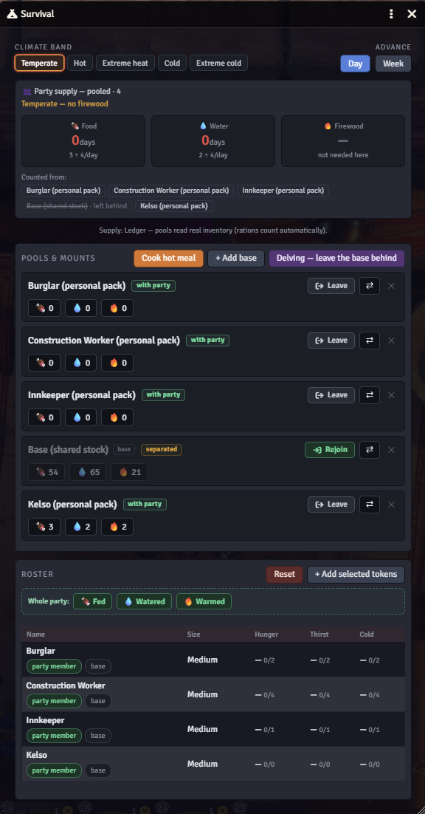
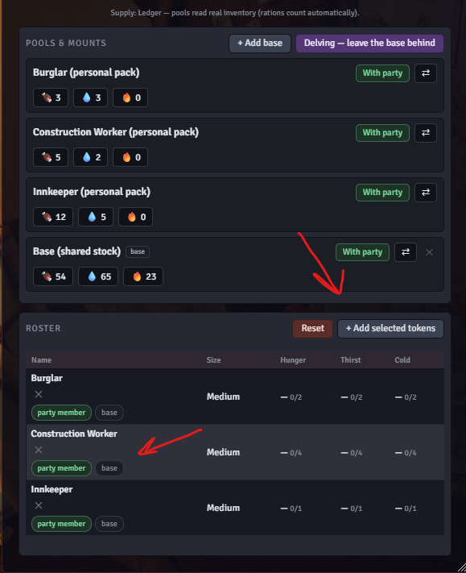
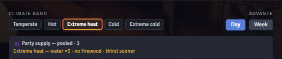
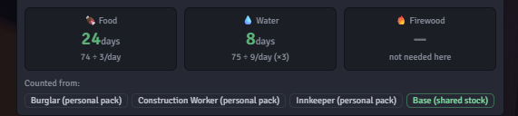
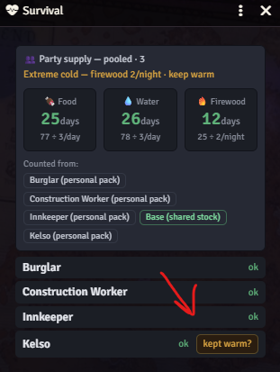
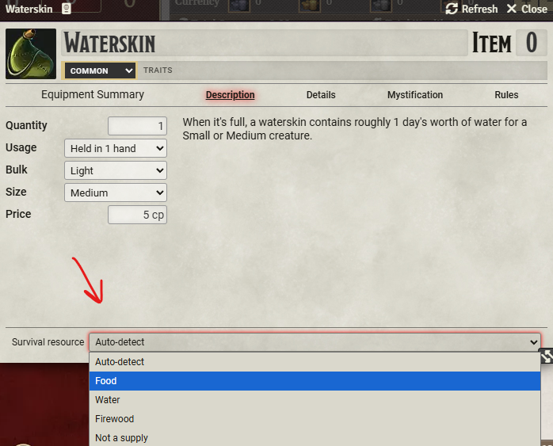
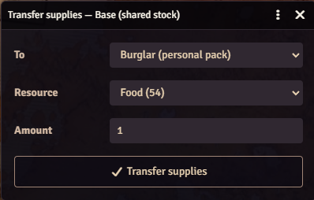
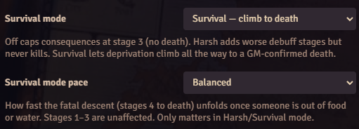
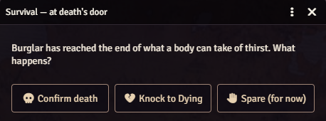
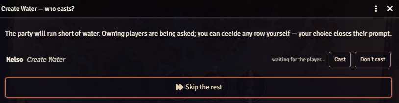

# TTRPG Survival System

[](https://github.com/Zeitcatcher/ttrpg-survival-system/releases/latest)
[](https://github.com/Zeitcatcher/ttrpg-survival-system/releases)

Track a party's food, water, and firewood in Foundry VTT, and let hunger, thirst, and cold catch up with them. It mostly runs itself, with no spreadsheet to keep.

> Everyone's supplies pool together. Leave the pack mule behind and the water you were counting on goes with it.



## What it is

TTRPG Survival System keeps the day-to-day bookkeeping of travel so you don't have to. Each day the party draws food and water from a shared pool: the characters' own packs, a base or stockpile, and mounts that carry supplies. The module tells you how many days are left before someone goes without. Run dry and hunger, thirst, or cold set in as escalating, readable statuses that ease back off once the party recovers.

Climate matters. A desert doubles or triples water use; a frozen pass needs firewood every night or the cold starts to bite. Larger creatures eat more. And a base or mount left behind in another region stops counting the moment it's separated. The number drops off a cliff, on purpose.

It sits in the background: mostly automated, with a GM panel and a player HUD that make the state legible at a glance, and a single daily summary in chat instead of a pile of messages.

## System support

The survival engine is system-neutral: it carries its own rules and reads nothing from the game system. Consequences, inventory, and skills go through a per-system adapter. The first and currently shipped adapter is Pathfinder 2e: deprivation applies native pf2e conditions, creature size scales consumption, and rations and waterskins are read from real inventory.

It's verified on Pathfinder 2e (Foundry v13 and up, tested on v14). The architecture is ready for other systems; those adapters aren't written yet.

## Features

- One shared supply pool across party packs, a base or stockpile, and mounts, with a separation rule so the party can't draw from what it left behind.
- A days-of-supply header that shows its own math: the pooled total ÷ the party's daily need, per resource, and the pools it counted.
- Graded hunger, thirst, and cold as native Pathfinder 2e conditions (Fatigued, Clumsy, Drained, and so on), applied as the party starves and cleared as it recovers.
- Optional Survival mode: let deprivation climb past the safe cap into worse conditions and, eventually, a death you confirm, at a pace you choose.
- Five climate bands: heat multiplies water use (up to ×3) and brings thirst on a day sooner; cold burns firewood each night, three bundles in the cold and six in extreme cold.
- Size-scaled consumption: Large ×2, Huge ×4, Gargantuan ×8.
- Two supply modes: Ledger reads real actor inventory (Rations counted by their charges, waterskins, and any item you tag); Abstract is simple typed day-counts.
- A GM panel and a read-only player HUD, plus one consolidated daily upkeep card in chat, grouped by character.
- Advance a day, a week, or any number of days, or let the world clock drive it.
- Roster tools: add selected tokens, mark a creature as a mount or a base, transfer supplies between pools, remove the dead, and reset statuses.
- Foraging (a Survival check), hot meals (a well-fed buff), and water-creating spells like Create Water, prompted with the player deciding and unused water evaporating at day's end.
- English and Russian.

## Requirements

- Foundry VTT v13 or newer (tested on v14).
- Pathfinder 2e: the current adapter uses its conditions, skills, and items.
- socketlib, required, to route player actions to the GM.

## Installation

In Foundry, open Add-on Modules, choose Install Module, and paste this manifest URL:

```
https://github.com/Zeitcatcher/ttrpg-survival-system/releases/latest/download/module.json
```

Enable TTRPG Survival System and socketlib in your world.

## How it works

1. Open the survival panel from the token toolbar, select the party's tokens, and add them. Each character joins with a personal pack; mark a Huge or Gargantuan mount as a base and it carries the shared stock.



2. Set the climate band for where the party is. The header spells out the effect ("Extreme heat: water ×3, no firewood"), and each resource shows how long it will last: the pooled total ÷ the party's daily need.



3. Advance a day or a week. The party draws from the pools that are with it, and you get one chat card that summarizes what was consumed and who went without, grouped by character.



4. Go too long without and native conditions land on the characters; feed and water them and the conditions step back down.

Players get a read-only HUD with the party's status and, in the cold, a "kept warm tonight" toggle for the characters they own.



## Supply: Ledger or Abstract

Ledger mode, the default, reads real actor inventory: a Pathfinder Rations item counts by its actual charges (a 1-of-7 stack is one day, not a week), waterskins count as water, and you can tag any item as food, water, or firewood on its sheet. When the party eats, the real items go down.



To keep it abstract instead, switch Supply detail to Abstract and the pools become simple day-count numbers you edit by hand.

## Sharing and separation

Supplies pool, but sharing between characters is deliberate: a transfer moves food, water, or firewood from one pool to another (real items in Ledger mode). Mark a base or mount "not with the party" (or use the Delving button), and its stores drop out of the total until the party rejoins it.



## Survival mode

By default, deprivation stops at a safe stage: characters get miserable, but no one dies by accident. Turn on Survival mode and hunger, thirst, and cold keep climbing past that cap into worse conditions and, in the end, death. Three tiers set how far it goes: off, a harsh middle that piles on the extra penalties but never kills, or the full climb to death. A separate pace sets how fast those final days play out: slower, balanced, or faster.



Nothing dies on its own, though. When a character reaches the edge, you get a prompt to confirm the death, knock them to dying so the party can still save them, or spare them.



## Extras

- Foraging: a once-a-day Survival check that adds food to the shared pool.
- Hot meal: burn one firewood to give the party a well-fed buff, temporary Hit Points equal to each character's level. You can cook once a day, and the buff clears when the next day begins or the party takes a Rest for the Night.
- Create Water: when the party would otherwise go thirsty, a caster with a water spell prepared is prompted to cast it. The player decides, the GM can override, and any water the party doesn't drink that day evaporates.



## Settings

Supply mode, which needs are tracked, the upkeep prompt, source priority, climate model, survival mode and its pace, foraging and its DC, hot meals, water spells, the catch-up cap, and HUD density all live in the module settings.

## Development

```
npm install
npm test       # unit tests (Vitest)
npm run build  # type-check and bundle to dist/
```

The survival rules live in `src/core` as framework-free, fully tested modules. The Pathfinder 2e adapter is in `src/systems`, the Foundry state and glue in `src/state`, networking in `src/net`, and the UI in `src/apps`.

## Credits

Built for Foundry Virtual Tabletop by Zeitcatcher. Requires socketlib.

Pathfinder and Pathfinder Second Edition are trademarks of Paizo Inc. This module is an independent work, not published, endorsed, or approved by Paizo, and ships none of Paizo's Product Identity; it integrates with the Pathfinder 2e system's own rules implementation. For more about Pathfinder, see [paizo.com](https://paizo.com).

## License

[](LICENSE)

TTRPG Survival System is under the PolyForm Noncommercial License 1.0.0: free to use and modify for any noncommercial purpose, with a separate license required to sell it. See [LICENSE](LICENSE).
